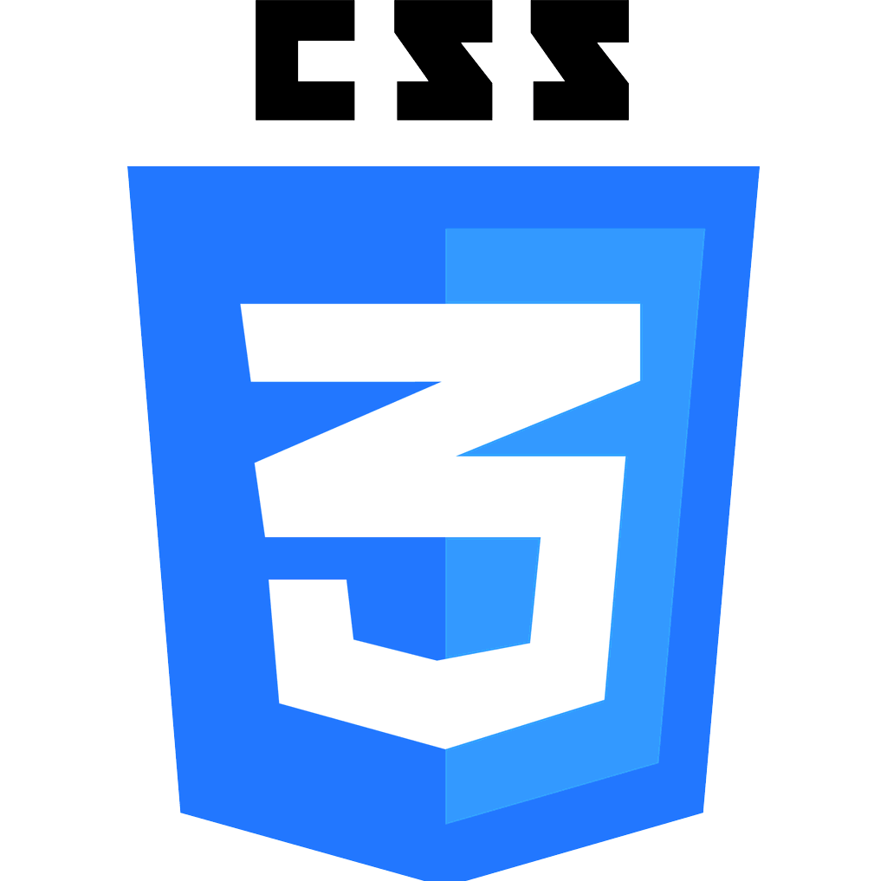
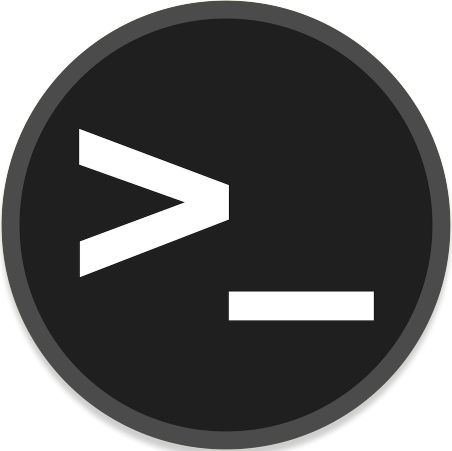
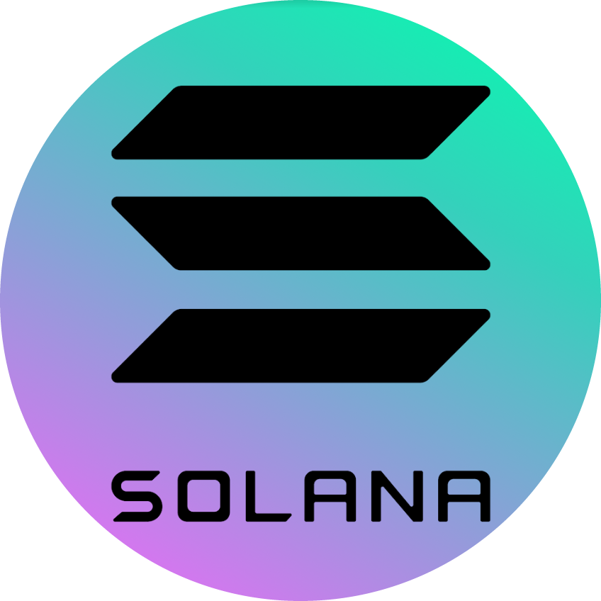
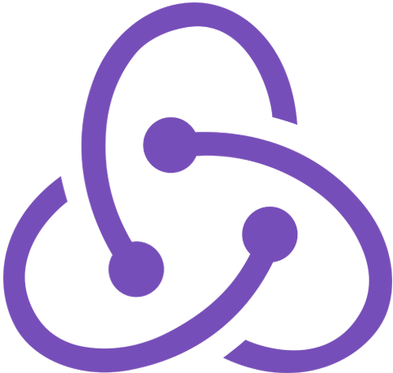
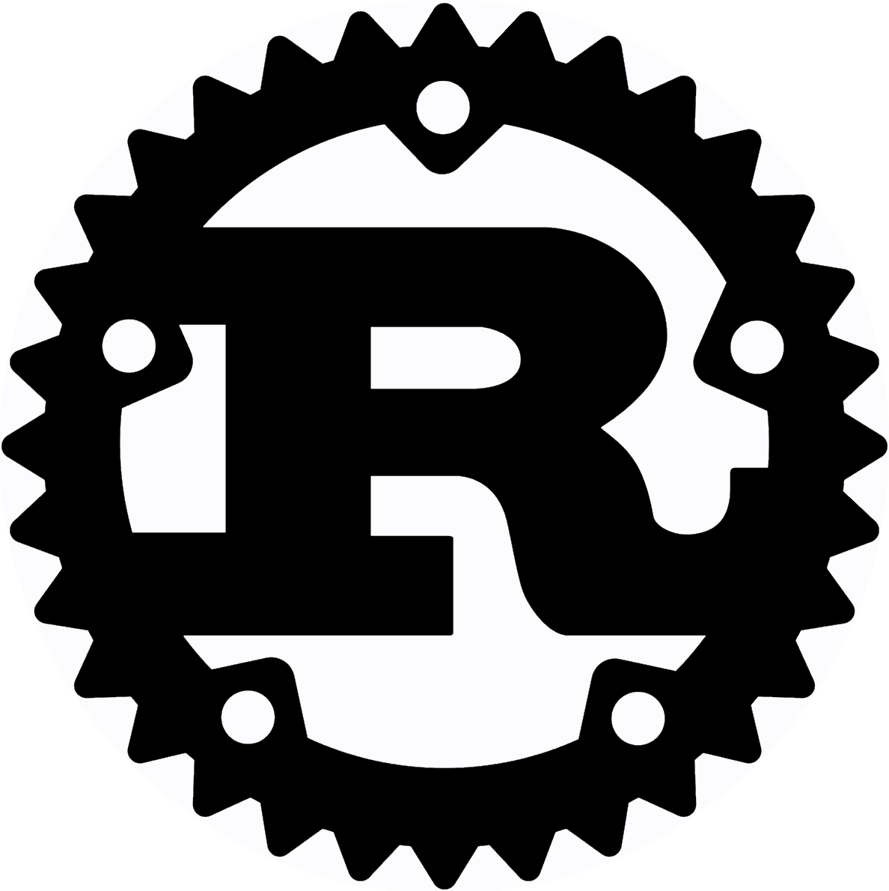
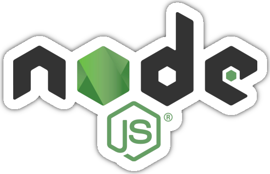
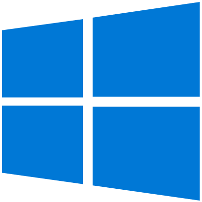

<h1 align="center">👋 Welcome to my GitHub profile ! 👋  </h1>

 

Hi, I'm Erwann.  I am a young French developer. I have been living nomadically for several years, I am passionate about development and tech in general.

<h2>🛠 Techs I use</h2>

  
  
  
  
  
  
  
  
  
  
  
  
  
  
  
  
  
  
  
  
  
  
  
   
   

  <h2>🔬 Techs I learn</h3>

  

    
    
    
    
    
    
    
    
    
  

  <h2>🖥 My favorite OS</h3>

  

    
    
    
    
    
    
    
  

 

  <h2>✉️ Contacts</h2>

  

    
    
    
    
    
  

